<h3>Je présente ma solution personnelle pour l'activité pratique numéro 3 consistant à développer une application Web JEE reposant sur Spring MVC, Thymeleaf et Spring Data JPA pour gérer les données des patients. Les fonctionnalités requises comprennent l'affichage des patients, la pagination, la recherche de patients, la suppression de patients, ainsi que d'autres améliorations.</h3>
<h4>1. Créer la vue "patients" pour l'affichage des patients</h4>
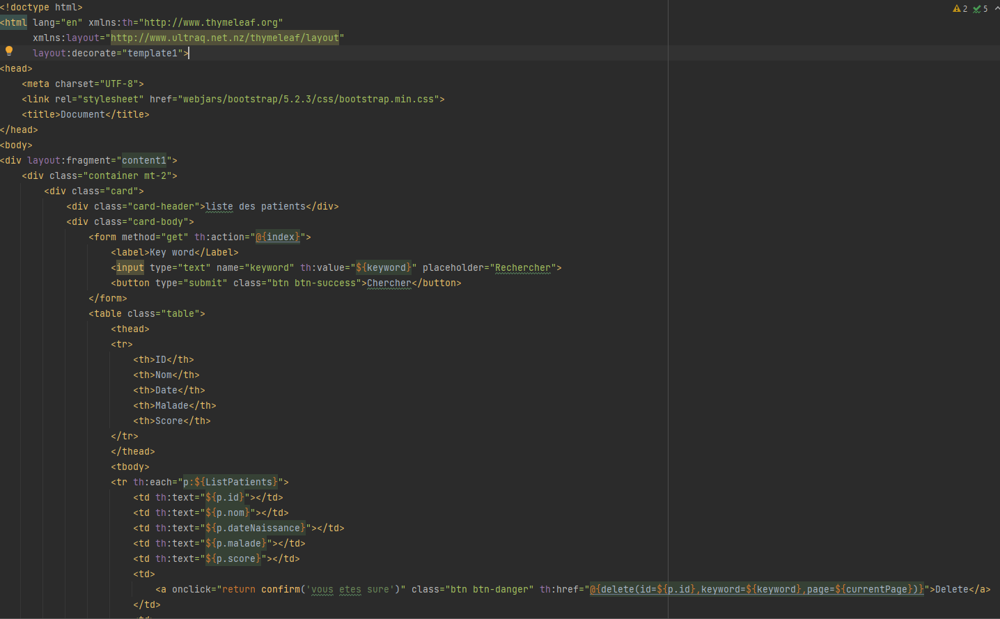
<h4>2. Resultat de la vue et utiliser Bootstrap pour style</h4>
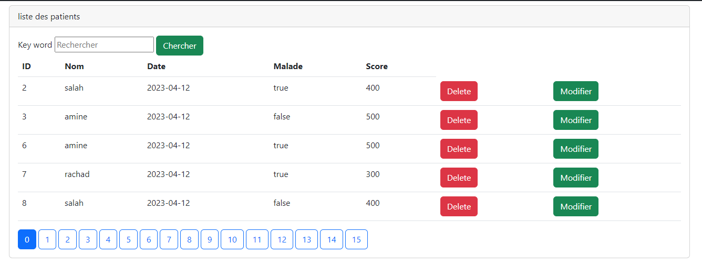
<h4>3. Les étapes pour pagination</h4>
<h5>1. Ajouter dans controller le nombres de patient affichee</h5>
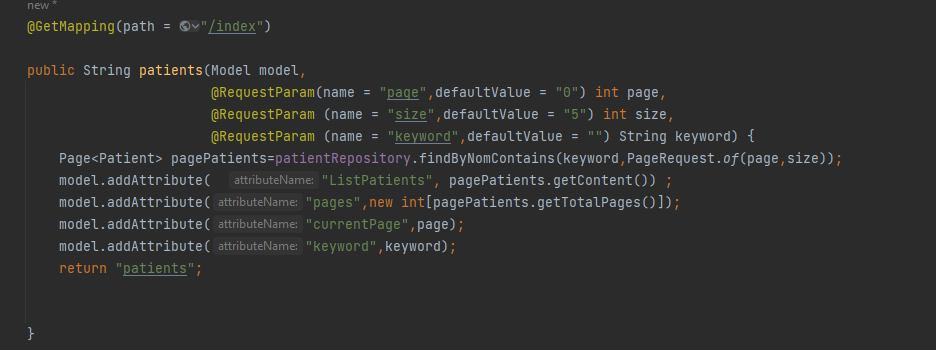
<h5>2. Pour la page courante</h5>
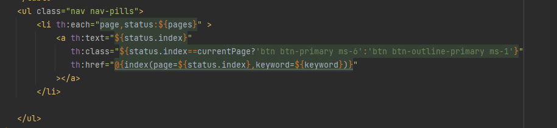
<h5>3. Affichage</h5>
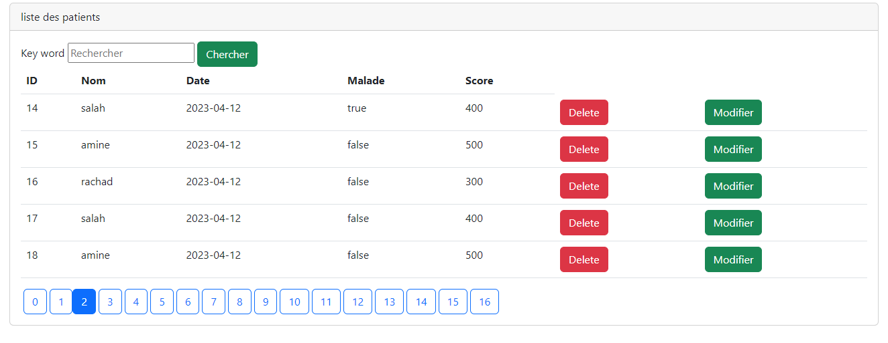
<h4>4. Récupérer le mot clé saisi pour rechercher un patient</h4>

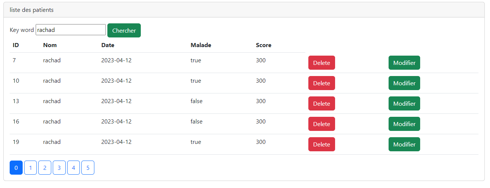
<h4>5. Supprimer un patient</h4>
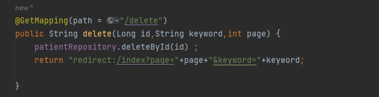
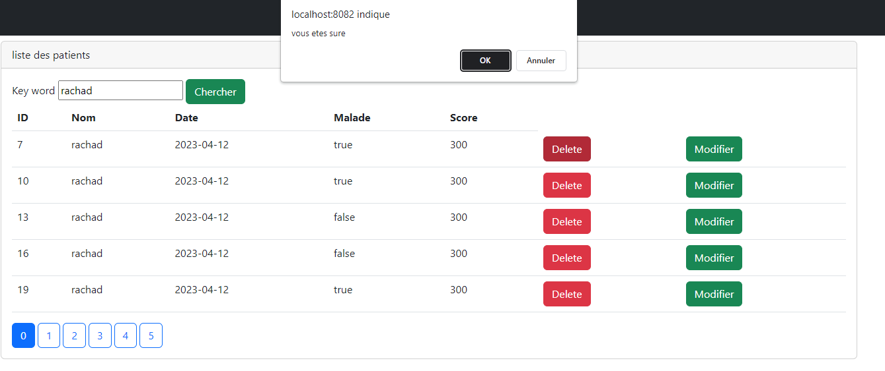
<h3>Part 2- Spring Boot Spring MVC Thymeleaf Spring Data Intellij</h3>
<h4>1. Ajouter Header</h4>
<h5>Ajouter une classe template "template1"</h5>
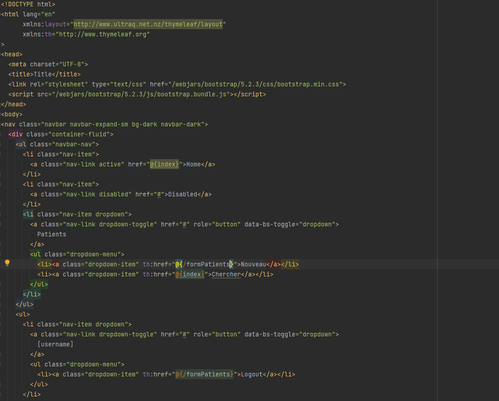
<h5>2. Affichage</h5>
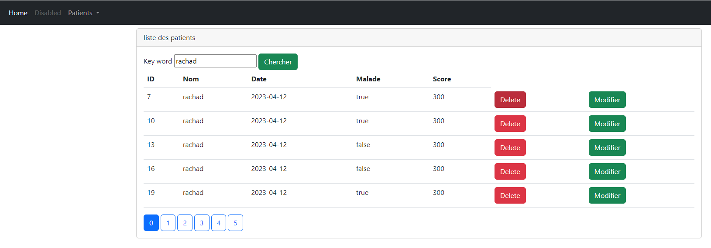
<h4>2. Créer un formulaire pour ajouter les patients</h4>
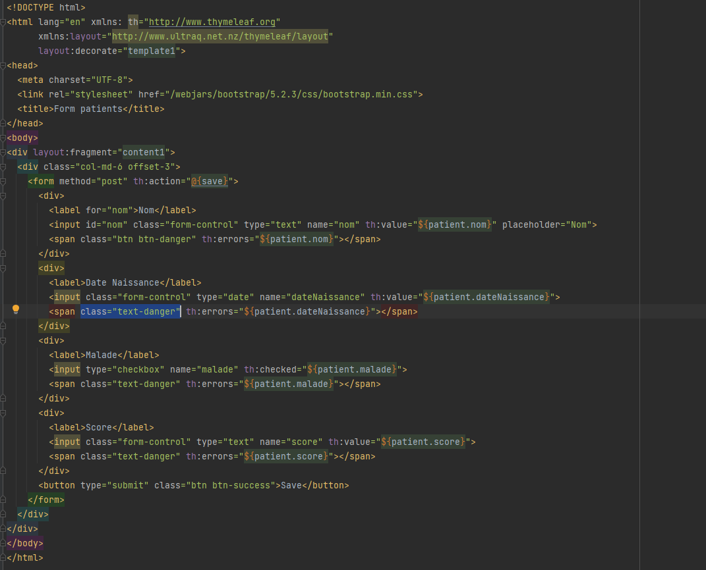
<h4>3. Ajouter les deux méthodes "formPatients" et "Save" au niveau de controleur pour valider les informations et enregistrer le patient</h4>
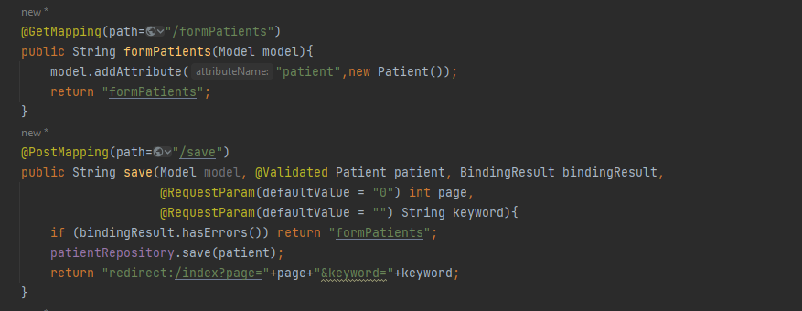
<h4>Test</h4>
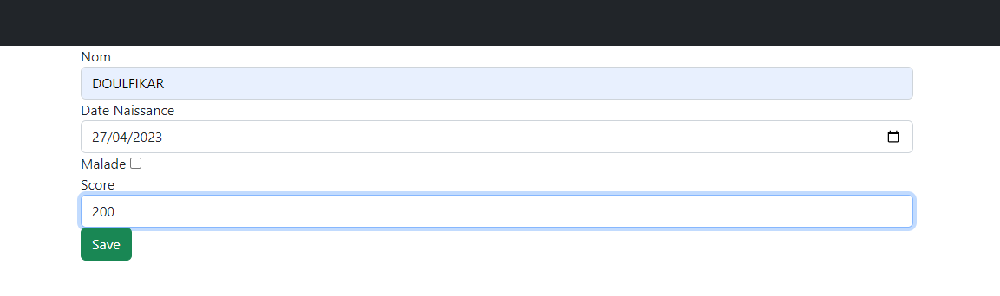
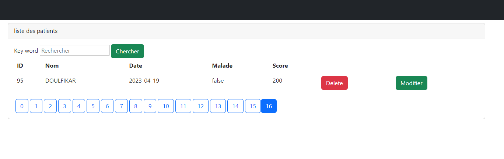
<h4>4. Créer un formulaire pour modifier les patients</h4>
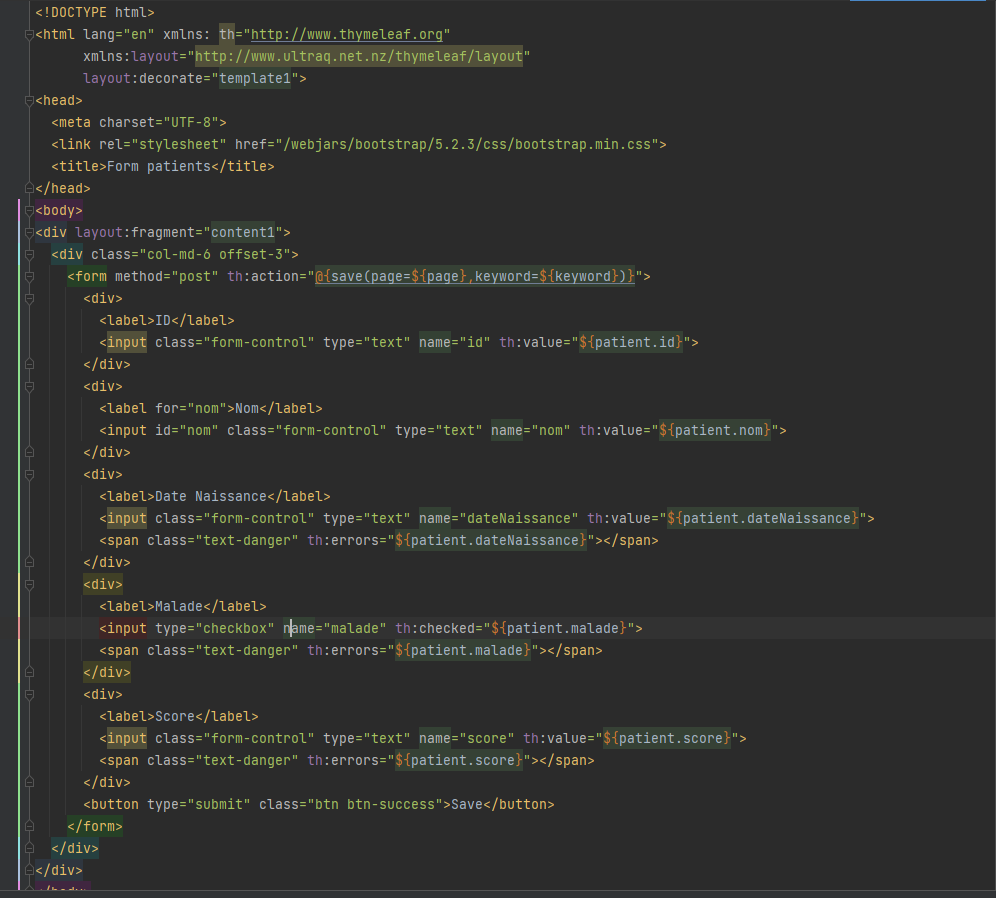
<h4>5. Créer methode editPatient</h4>
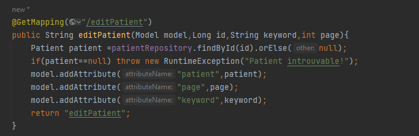
<h4>Test</h4>
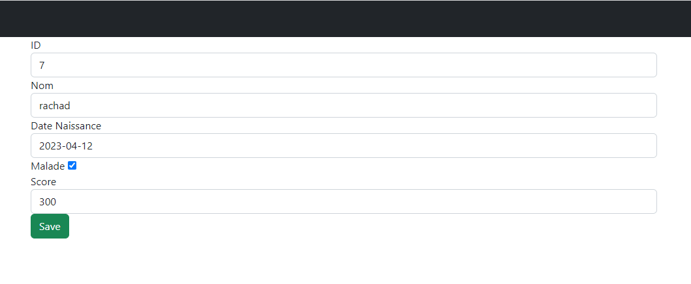

